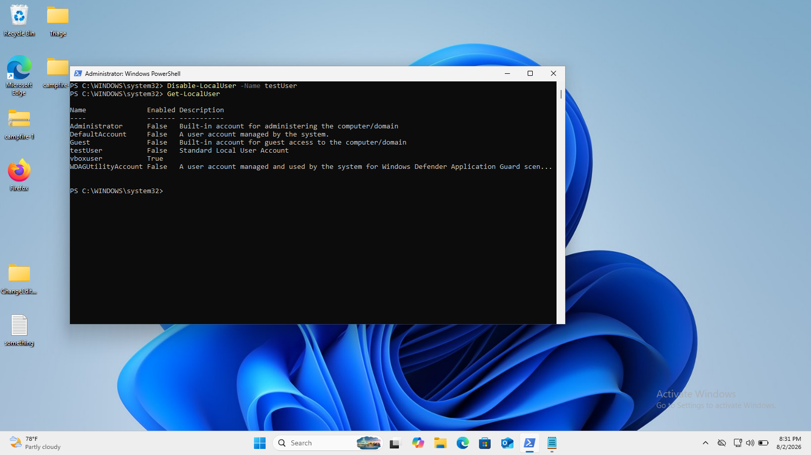
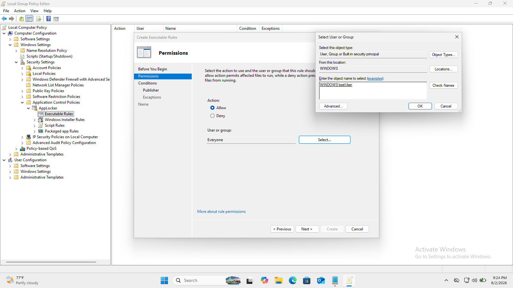
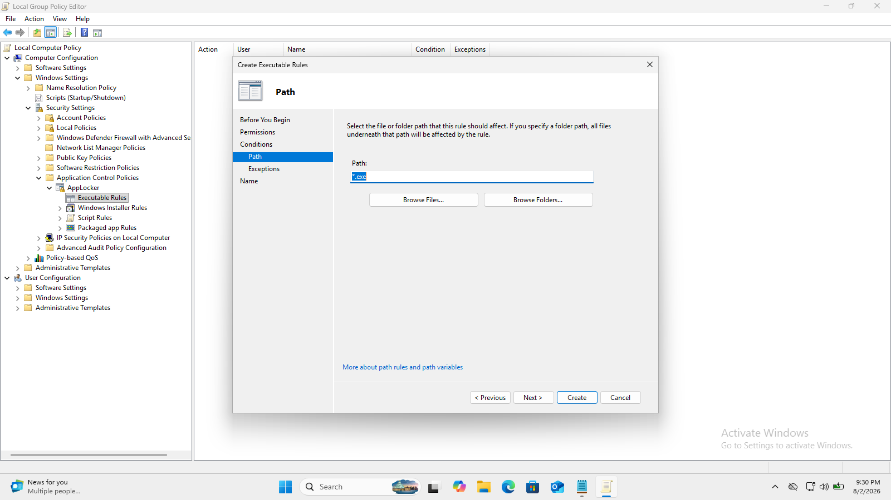
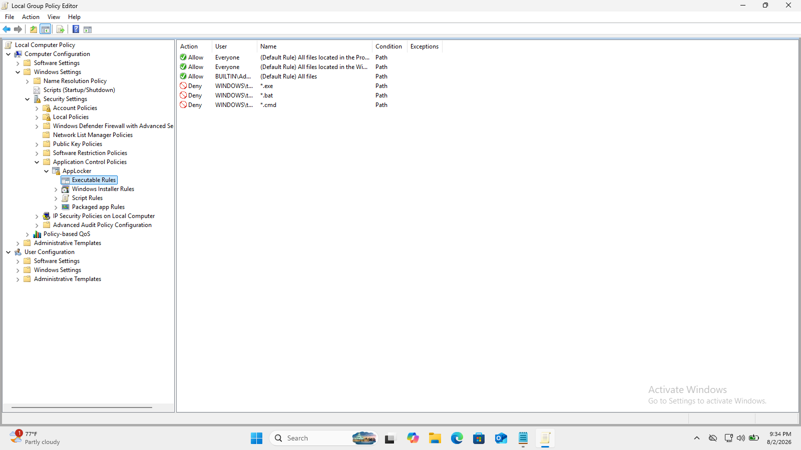
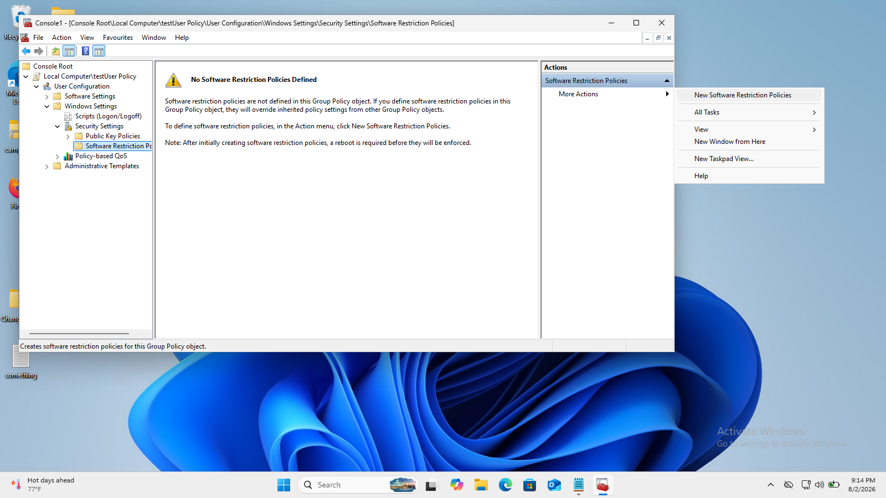
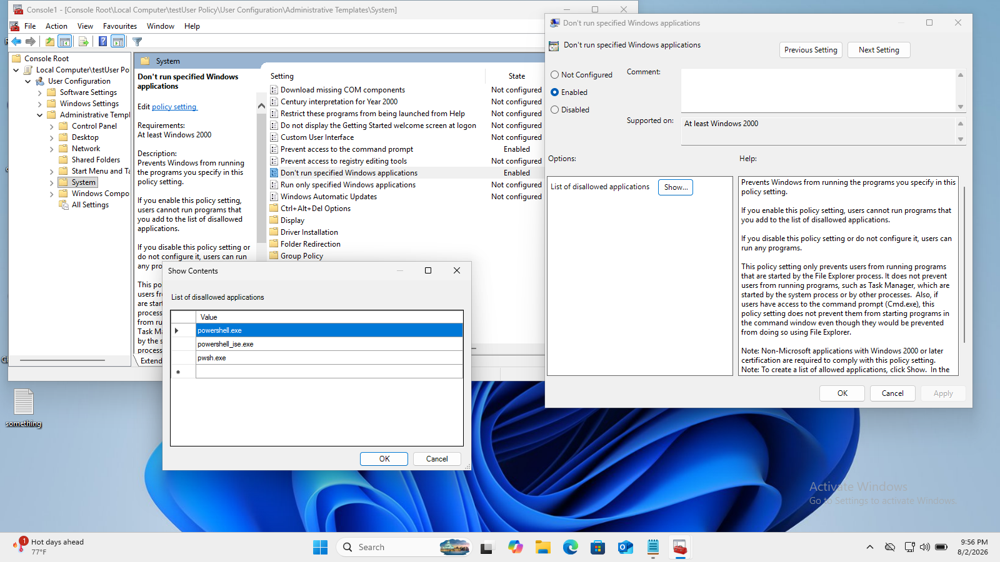

# Setting up our attack and defense

For this lab I created five custom rules that generate alerts for failed and successful RDP login attempts. I put these rules in `/var/ossec/etc/rules/local_rules.xml` and then restarted the wazuh-manager. After restarting, everything should work as expected.


What these rules do (in order):

- **100100**: Alert when an RDP connection fails.
- **100101**: Alert when 10 failed RDP connection attempts occur within 2 minutes.
- **100102**: Alert when 20 failed RDP connection attempts occur within 2 minutes.
- **100103**: Alert when there is a successful RDP connection attempt.
- **100104**: Alert when a successful RDP connection occurs after multiple failed attempts.

I also created two additional custom rules to detect possible reconnaissance / nmap scan attempts:


- **100105**: Creates a low-severity alert when security events 5156 or 5157 are observed. These events can be very noisy and flood storage, so I added the `no_full_log` option to reduce logging volume.
- **100106**: Uses 100105 as a baseline and triggers when 30 instances of rule 100105 are fired within 2 minutes from the same IP address — a possible port scan.

Now it's time to simulate an attack using the netexec tool. I also created an additional user account on the Windows machine so we can see results more clearly.

Credentials for the test user:

- username: `testUser`
- password: `liebling`

In a typical attack there is a reconnaissance phase first. In this scenario, the attacker first scans for open ports, discovers the RDP port, and enumerates usernames using a username list. After enumerating usernames, the attacker waits (as needed) and then brute-forces passwords using a password list.

To enable the attack, I made the Windows machine vulnerable by enabling Remote Desktop and allowing the RDP firewall rule:

```powershell
Set-ItemProperty -Path 'HKLM:\System\CurrentControlSet\Control\Terminal Server' -Name "fDenyTSConnections" -Value 0

New-NetFirewallRule -DisplayName "Allow RDP" -Direction Inbound -Protocol TCP -LocalPort 3389 -Action Allow
```

- The first command enables RDP by changing the registry key value.
- The second command creates a firewall rule to allow incoming RDP requests.

Now the system is vulnerable and we can attack.

First step of recon:


As we can see, multiple ports are open; we are interested in port **3389**, the default port for RDP.

Rule 100106 is utilized to detect the scan. When an nmap scan is performed, the following alert appears in Wazuh:


Using the open 3389 port, we enumerate usernames on the target machine using the netexec tool (hydra could also be used):


This shows up in our SIEM as:


After multiple failed logon attempts for `testUser`, the account becomes locked out. In enterprise environments this might be configured for longer lockouts, but on the default machine this is observable after only a few failures.

Now the active scanning phase is finished. The attacker can wait for the lockout to expire and then brute-force passwords from the wordlist.


As we can see, the attacker found the password for the target account.

I also created a dashboard for easier visualization:


From this access, the attacker can perform lateral movement or exfiltrate data. For testing, I ran `whoami.exe` after gaining access to the system. We can see execution of `ipconfig` and `whoami` on the Wazuh Discover page by filtering for rule **100108**, which corresponds to PowerShell or CMD execution of another process:


Rule **100107** is triggered when PowerShell creates a new file. Both rules are custom-made. Example:


As part of the attack I first attempted to download a mimikatz.zip archive for credential dumping. Windows Defender deleted that file immediately in this environment:


After that, I created a batch file that sends `exploited.data` to `192.168.100.60`. My custom rules detected both the file creation and the exfiltration:


The attack is now complete: the attacker exfiltrated data to their machine. Next, we fix the issues that enabled the attack: incorrect permissions and other weaknesses.

Immediate remediation steps

1. Close the opened RDP port.
2. Disable the `testUser` account (recommended) or change its password.
3. Remove command execution permissions from `testUser`.
4. Remove PowerShell and CMD access from `testUser`.

#### Close the opened RDP port

Run the following PowerShell commands:

```powershell
# Turn Network Level Authentication on
Set-ItemProperty -Path 'HKLM:\System\CurrentControlSet\Control\Terminal Server\WinStations\RDP-Tcp' -Name 'UserAuthentication' -Value 1

# Deny RDP connections
Set-ItemProperty -Path 'HKLM:\System\CurrentControlSet\Control\Terminal Server' -Name "fDenyTSConnections" -Value 1

# Stop and disable the Remote Desktop service
Stop-Service -Name 'TermService' -Force
Set-Service -Name 'TermService' -StartupType Disabled

# Disable Remote Desktop firewall rules
Disable-NetFirewallRule -DisplayGroup 'Remote Desktop'
```

These commands perform the following:

- Enable Network Level Authentication.
- Deny connections to the Remote Desktop Service.
- Stop and disable the Remote Desktop service.
- Disable the Remote Desktop group in Windows Firewall.

#### Disable `testUser` account



The following commands disable a local user account. (To disable an Active Directory account, use the `Disable-ADAccount` cmdlet.)

```powershell
# Example: disable local user
# Disable-LocalUser -Name 'testUser'  # Uncomment to run if supported in your environment
```

#### Remove permissions to execute any executables from `testUser`

I used `gpedit.msc` to create AppLocker rules:

- Open: Computer Configuration -> Windows Settings -> Security Settings -> Application Control Policies -> AppLocker -> Executable Rules
- Create a path rule that blocks `*.exe` for the `testUser` or the user group.
- Repeat for `.bat` and `.cmd` extensions.

Screenshots:









#### Remove permissions to launch PowerShell and Command Prompt from `testUser`

1. Press Windows+R, type `mmc`, and press Enter to open Microsoft Management Console.
2. In File -> Add/Remove Snap-in, choose Group Policy Object Editor.
3. Click Add..., then Browse -> Users -> `testUser`, and click OK to edit policy for that user specifically.
4. Navigate to: User Configuration -> Administrative Templates -> System
5. Set **Prevent access to the command prompt** to `Enabled` and use the `Show...` button to list all possible names for PowerShell's executables to block.




With these settings enabled, `testUser` cannot launch PowerShell or the command prompt.


---

*Edited for improved formatting, consistent styling, and corrected typos while keeping the original structure and content.*
