For this I created 5 custom rules that makes an alert if there is failed, succesful login attempts using RDP. I put these rules inside /var/ossec/etc/rules/local_rules.xml file.
Then again restart wazuh-manager. Now everything should work just fine.
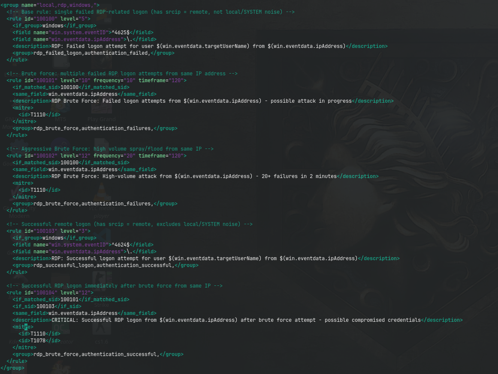

What does these rules basically do is with the order:
100100: just creates alert when rdp connection is failed.
100101: creates alert when 10 failed rdp connection attempts is made in 2 minutes
100102: creates alert when 20 failed rdp connection attempts is made in 2 minutes
100103: creates alert when there is succesful rdp connection attempt happening
100104: creates alert when succesful rdp happens after multiple failed attempts.

I also made addtional 2 custom rules for detection of possible recon/nmap scan attempts which is like this:
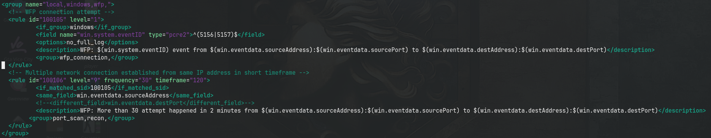

100105 creates low severity level alert when security event 5156 or 5157 is happening. Which can be really draining our storage and flood all alerts. So I just added option no_full_log do decrease space that is needed for it.
100106 takes 100105 as baseline and is created when 30 100105 alerts are fired in 2 minutes from same ip address which might indicate port scan. 

Now it is time to simulate attack using netexec tool. I also created additional user account on windows machine so, we can see results better. New user credentials is like this
username:testUser
password:liebling

In usual attack there is always a reconnaissance phase before everything. 
So in my attack scenary attacker first learns if there is any open ports. He should see there is open rdp port and enumerate it using username list to learn what usernames exist inside. And only then if first 2 step succesful he will brute force rdp using password list.

For this i created 2 separate wordlists. One for usernames and other for possible passwords. For attack to be able to happen I need to make windows machine vulnerable. For this I enabled Remote Desktop Service and allowed incoming RDP requests in Windows Firewall using this 2 powershell commands.

```
Set-ItemProperty -Path 'HKLM:\System\CurrentControlSet\Control\Terminal Server' -Name "fDenyTSConnections" -Value 0

New-NetFirewallRule -DisplayName "Allow RDP" -Direction Inbound -Protocol TCP -LocalPort 3389 -Action Allow
```
First command is to enable RDP and for that changes registry key's value. Second command creates a new rule to enable incoming/inbound RDP requests

Now my system is vulnerable we can attack.
First step of recon:
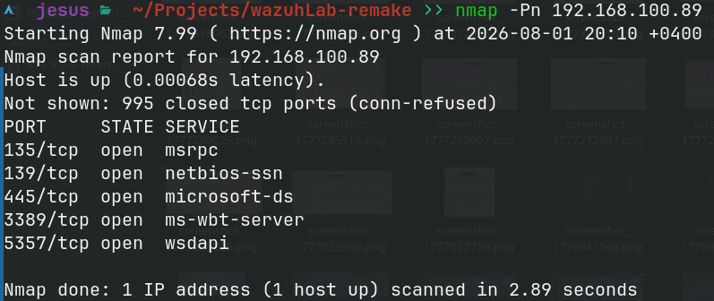

As we can see there is multiple open ports but currently what we seek for is 3389 which is default port for RDP. 
I utilize rule 100106. As we can see when nmap scan is happening this alert shows up on Wazuh:
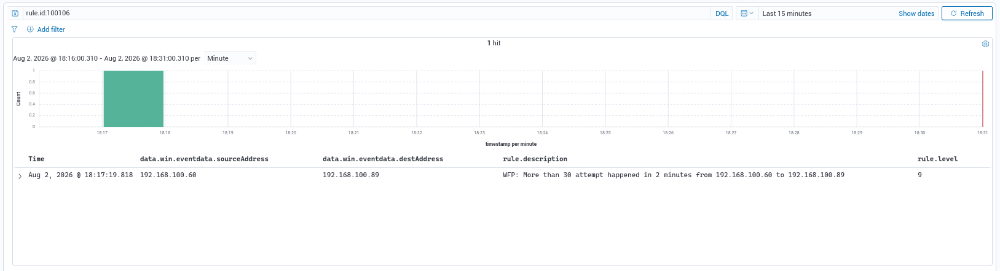

Utilizing open 3389th port we enumerate for what usernames exists in target machine using netexec tool.(instead hydra can be utilized)
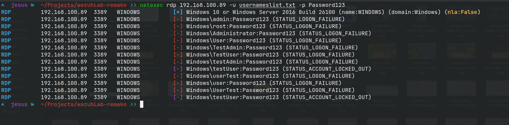

this shows up on our SIEM like this:
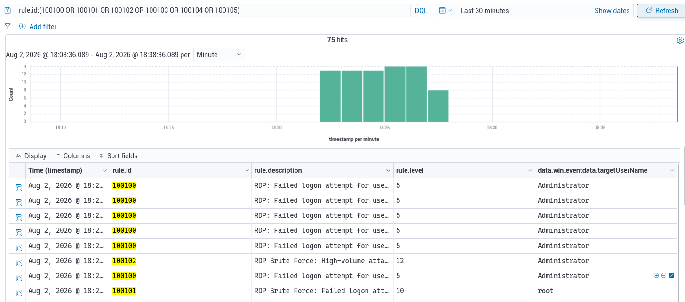
After multiple failed logon attempts to our user testUser its status is locked out. This might be set to endless lockout in enterprise environment but in our case this is default machine. In default settings after 10 unsuccessful login attempts we can see testUser account is locked for 10 minutes.
This way attacker learnt which users are there in target machine. So active scanning phase is finished. Now attacker should wait for lock out to finished and brute force wordlist on hand to find password of testUser.
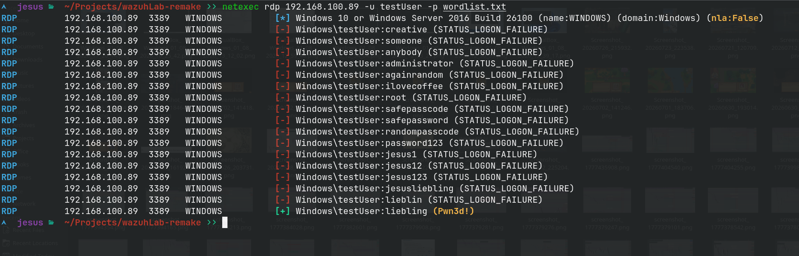
as we can see attacker found the passcode of wazuh.
We can also see it at the dashboard I have created for ease of visualization:
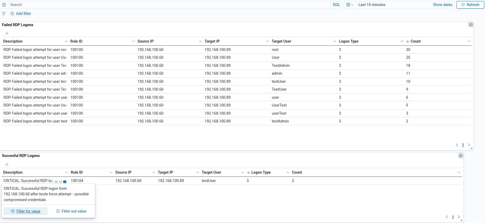

now he should either try lateral movement or take whatever data he can find and exfiltrate it from the account he has in hand. and obviously for testing I run whoami.exe after gaining access to system using rdp. 
we can see execution of ipconfig and whoami commands in our wazuh discover page just by filtering for rule number 100108 which stands for Powershell or cmd execution of another process.
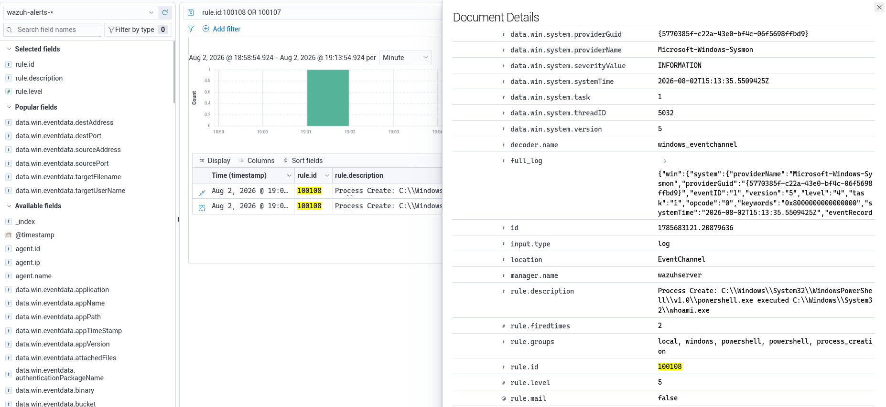
rule number 100107 also is triggered when powershell creates a new file. Both rules are custom made and is like this
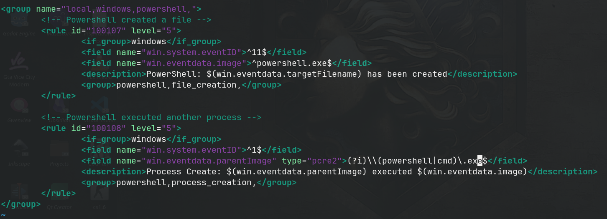


So as attack i first tried to download mimikatz.zip archive for credential dumping. But as it would be in real scenarios windows defender deleted that mimikatz.zip file instantly.
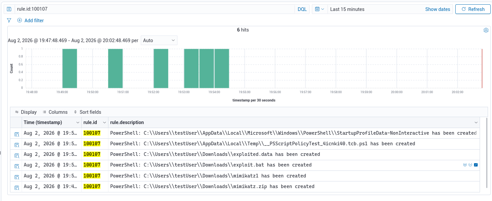
After seeing mimikatz being deleted I just tried to create a batch file and put a command inside that basically sends exploited.data file to 192.168.100.60 IP adress and my custom rules got both of them and triggered alert in wazuh discovery like this.
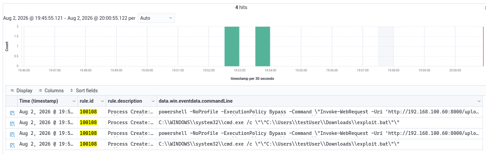
And now attack is done. Attacker exfiltrated data and send it to his own machine. Now it is time to fix what has caused attack. What permissions werent correct and how to fix against them. I already wrote detection rules. and now it is time to fix machine back to its corrected state.


1. Close opened RDP port
2. Disable account(recommended) or change password of testUser
3. Remove command execution permissions from testUser
4. Remove powershell and cmd access from testUser

#### Close Opened RDP port
```
PS C:\WINDOWS\system32> Set-ItemProperty -Path 'HKLM:\System\CurrentControlSet\Control\Terminal Server\WinStations\RDP-Tcp' -Name 'UserAuthentication' -Value 1
PS C:\WINDOWS\system32> Set-ItemProperty -Path 'HKLM:\System\CurrentControlSet\Control\Terminal Server' -Name "fDenyTSConnections" -Value 1
PS C:\WINDOWS\system32> Stop-Service -Name "TermService" -Force Set-Service -Name "TermService" -StartupType Disabled
PS C:\WINDOWS\system32> Disable-NetFirewallRule -DisplayGroup "Remote Desktop"
```
This command will do these in order: 
* Turn Network Level Authentication on, 
* deny connections to Remote Desktop Service
* disable running Remote Desktop Service
* disable Remote Desktop group in Windows Firewall

#### Disable testUser account

These 2 coimmands disable the local user account. Though to disable active directory account we would use: `Disable-ADAccount` cmdlet.

#### Remove permissions to execute any executables from testUser account
I utilized gpedit.msc for this. With right clicking Computer Configuration -> Windows Settings -> Security Settings -> Application Control Policies -> AppLocker -> Executable Rules and choosing New Local Rule option a dialog opens. There I chose which user to apply and 

According to Path and used \*.exe to disable execution of all .exe extensioned files.

I also used same steps to create rules for .bat and .cmd files. Now it looks like this:


#### Remove permissions to launch powershell and command prompt from testUser account
After pressing Windows+R I wrote mmc and launched Microsoft Management Console. 
At File->Add/Remove Snap-In I chose Group Policy Editor and then clicked Add...->Browse->Users->testUser  and clicked OK. Now I can add a GPO for specifically testUser. 
In User Configuration -> Administrative Templates -> System there is prevent access to command prompt option this should block testUser to access command prompt. But this doesn't prevent user to run powershell. Because of this at the same "System" subcategory there is "Don't run specified Windows applications"
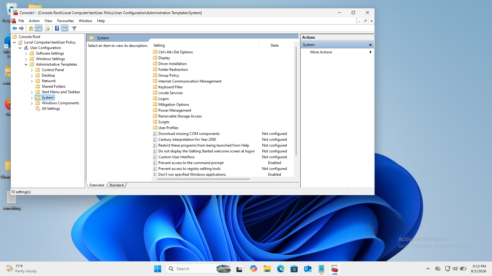
with clicking "Enabled" there and the "Show..." button I wrote down all possible names for Powershell's execution.

testUser can't launch Powershell and Command prompt at all
