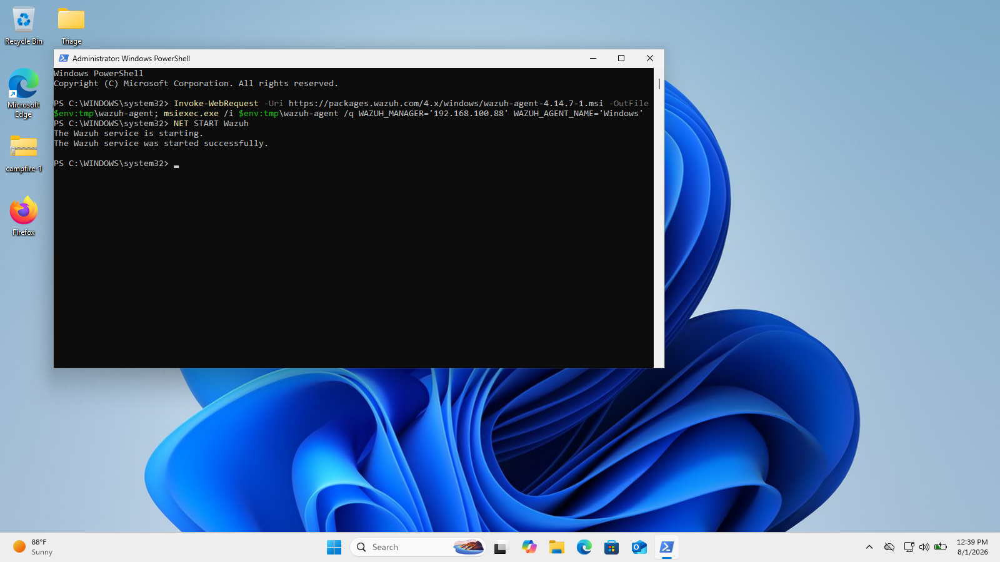
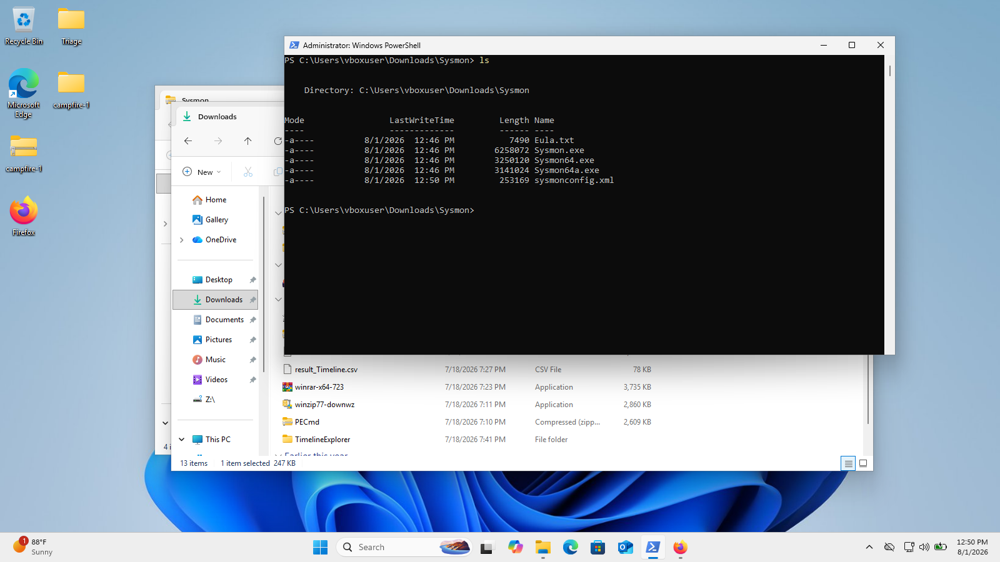
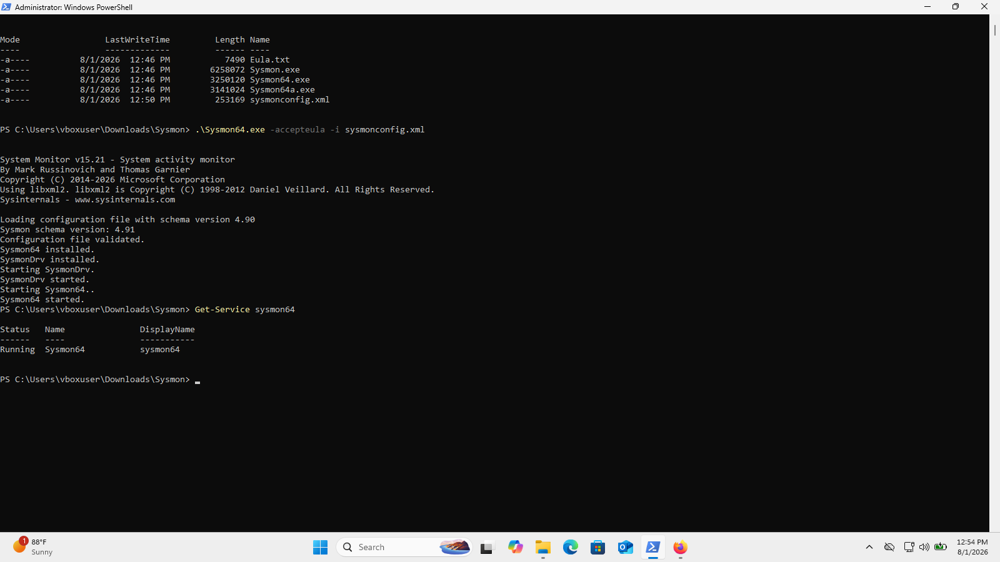
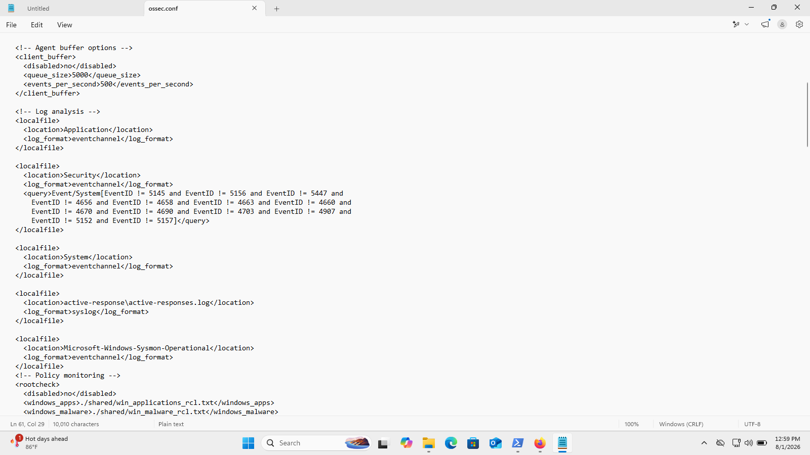
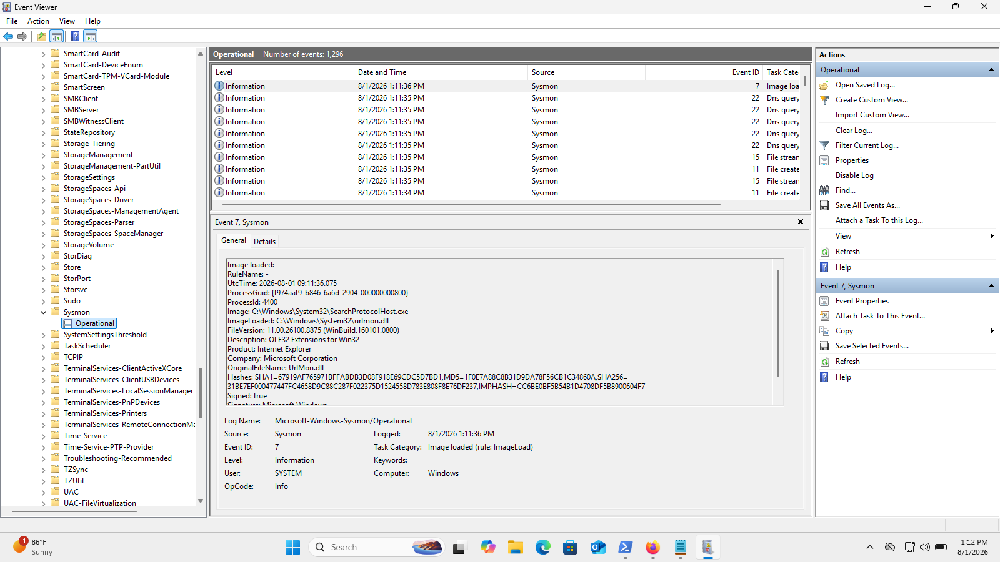

# Setup Windows agent for Wazuh

Why: this agent is going to be the main log source for our indexer in Wazuh.

I clicked the "Deploy new agent" option in the Wazuh Dashboard, selected the agent machine as Windows, and set the server IP address to `192.168.100.88` (the IP address of the machine where the Wazuh server is deployed).

To install the agent I used the one-liner provided by the dashboard. Example (PowerShell):

```powershell
Invoke-WebRequest -Uri https://packages.wazuh.com/4.x/windows/wazuh-agent-4.14.7-1.msi -OutFile $env:tmp\wazuh-agent;
msiexec.exe /i $env:tmp\wazuh-agent /q WAZUH_MANAGER='192.168.100.88' WAZUH_AGENT
```

This basically downloads the installer and sets up the agent.

After installation finished I ran the following in an elevated PowerShell prompt to start the service:

```powershell
NET START Wazuh
```

The agent starts and our Windows logs are now being sent to the Ubuntu Wazuh server deployment.



I also want to send Sysmon logs to the server. To do this I set up Sysmon as follows.

From this link:

> https://learn.microsoft.com/en-us/sysinternals/downloads/sysmon

I downloaded Sysmon as a ZIP archive.

I also needed a `sysmonconfig.xml` file as the configuration for Sysmon. I installed Olaf Hartong's `sysmonconfig.xml` (available on his GitHub) — this is the standard choice used in many labs.



After unzipping `sysmon.zip` and placing `sysmonconfig.xml` in the appropriate location, I installed Sysmon using an elevated PowerShell prompt. Sysmon is now running:



At this point, Sysmon is generating events on the Windows machine, but they are not yet sent to the Wazuh server. To forward Sysmon event channel logs, edit the Wazuh agent configuration file at:

`C:\Program Files (x86)\ossec-agent\ossec.conf`

Add the following block under the Log Analysis section (using an elevated editor such as Notepad run as Administrator):

```xml
<localfile>
    <location>Microsoft-Windows-Sysmon/Operational</location>
    <log_format>eventchannel</log_format>
</localfile>
```



Then restart the Wazuh agent service:

```powershell
Restart-Service -Name wazuh
```

Now we have an active Wazuh agent sending Windows and Sysmon events to the Wazuh server.


I also verified Sysmon in Event Viewer and confirmed that events are being generated locally on the Windows machine:



By default many events are archived and do not automatically become alerts in Wazuh — we need to ensure the correct rules and decoders are present to generate alerts as required.

I restarted the Filebeat service on the server and checked connectivity using the following commands:

```bash
sudo systemctl restart filebeat
sudo systemctl status filebeat
sudo filebeat test config
sudo filebeat test output
```

The command output is shown in the screenshot below:


After this I still couldn't see the `wazuh-archives` option in the Discover data selector menu, so I created a Wazuh index pattern in the dashboard.

To create the index pattern:

1. Go to Dashboard -> Management -> Index Patterns -> Create Index Pattern.
2. Enter `wazuh-archives-*` as the Index Pattern name and click Next step.


3. Select the time field `@timestamp` and click Create index pattern.


Now the Discover interface includes the new index pattern:


We can now view all events and filter them using the OpenSearch Dashboard Query language (DQL):


