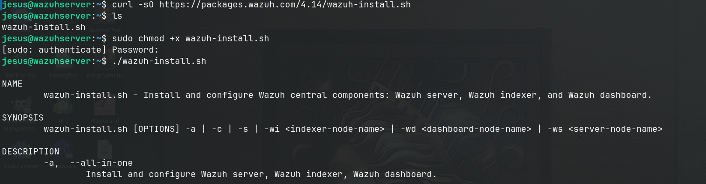
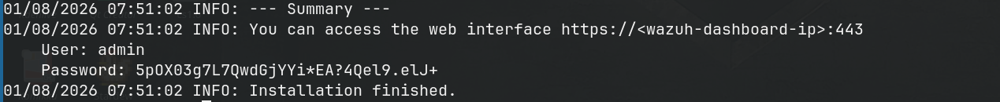
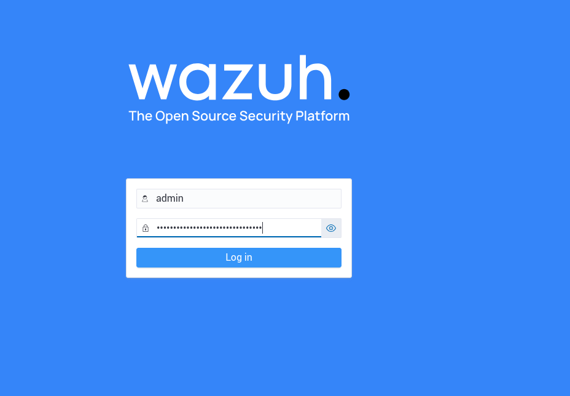

I firstly installed Ubuntu Server ISO and then setup a virtual machine in Oracle Virtualbox. 
Username:jesus
Passcode:liebling

I setup the machine in unattended mode for fast result. It didn't installed any additional packages like openssh-server and net-tools which would be needed for lab. So then I installed them using CLI commands.
`sudo apt install openssh-server net-tools -y` 
was enough. 
I then have created an ssh session from my main device to make the lab feel like it was based on cloud. And this way I could have easily copied my clipboard content without needing a VirtualBox Guest Additions iso additionally, which lets us share folders, clipboard and enables drag-n-drop features which is not needed right now. 
## After creating ssh session

Then I visited Wazuh SIEM/EDR solution's website and got one line of code that lets us install Wazuh parts(server, indexer,dashboard) to one machine. It is downloaded to machine using curl tool for the ease of use. Then I gave execution permission to the wazuh-install.sh file after checking its SHA256 key for confirming its being legit. 
Then I executed 
`sudo ./wazuh-install.sh -a `
command in which -a stands for  "all in one".

After waiting for 15-30 minutes installation of wazuh components finished and we got this password for accessing wazuh dashboard through browser

I used the ip address we have used when connecting using ssh and port number 443 to access dashboard.

After writing down credentials in dashboard login interface I got access to default dashboard.
